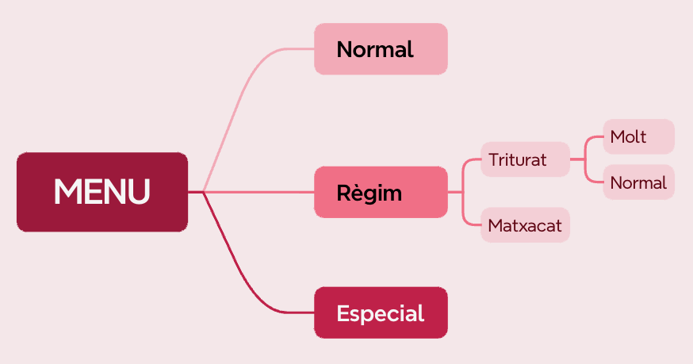
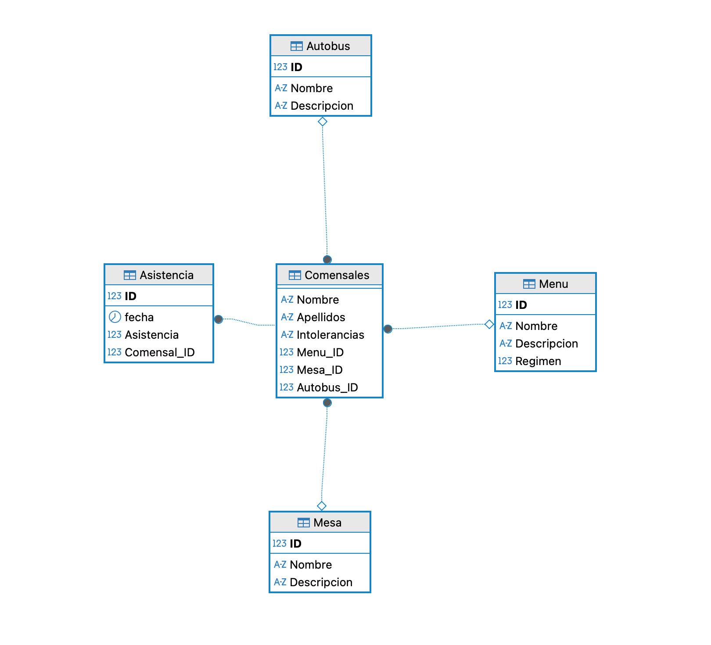

# Documentació de la Base de Dades: ComedorGo

**Motor de Base de Dades:** MySQL 8.0.43
**Codificació per defecte:** utf8mb4
**Collation per defecte:** utf8mb4_0900_ai_ci

La base de dades **ComedorGo** gestiona la informació de comensals, menús, taules, autobusos i l’assistència a menjars.

---

## 1. Taula `Asistencia`

**Descripció:**
Registra l’assistència dels comensals en cada data.

**Estructura:**

| Camp        | Tipus      | Nul | Descripció                                            |
| ----------- | ---------- | --- | ----------------------------------------------------- |
| ID          | int        | NO  | Identificador únic de l’assistència, autoincremental. |
| fecha       | date       | NO  | Data de l’assistència.                                |
| Asistencia  | tinyint(1) | SÍ  | Indica si el comensal va assistir (1 = sí, 0 = no).   |
| Comensal_ID | int        | NO  | Referència al comensal que va assistir.               |

**Claus:**

* **Primària:** `ID`
* **Única:** `(fecha, Comensal_ID)` → assegura que un comensal només tinga un registre per data.
* **Forana:** `Comensal_ID` → `Comensals(ID)`, amb accions `ON DELETE CASCADE ON UPDATE CASCADE`.

---

## 2. Taula `Autobus`

**Descripció:**
Emmagatzema informació dels autobusos disponibles per transportar els comensals.

**Estructura:**

| Camp        | Tipus         | Nul | Descripció                                        |
| ----------- | ------------- | --- | ------------------------------------------------- |
| ID          | int           | NO  | Identificador únic de l’autobús, autoincremental. |
| Nombre      | varchar(100)  | NO  | Nom de l’autobús, únic.                           |
| Descripcion | varchar(1000) | SÍ  | Descripció o informació addicional de l’autobús.  |

**Claus:**

* **Primària:** `ID`
* **Única:** `Nombre`

---

## 3. Taula `Comensals`

**Descripció:**
Conté la informació de cada comensal del menjador.

**Estructura:**

| Camp          | Tipus        | Nul | Descripció                                        |
| ------------- | ------------ | --- | ------------------------------------------------- |
| ID            | int          | NO  | Identificador únic del comensal, autoincremental. |
| Nombre        | varchar(100) | NO  | Nom del comensal.                                 |
| Apellidos     | varchar(100) | NO  | Cognoms del comensal.                             |
| Intolerancias | varchar(300) | SÍ  | Intoleràncies alimentàries, si n’hi ha.           |
| Menu_ID       | int          | SÍ  | Referència al menú assignat al comensal.          |
| Mesa_ID       | int          | SÍ  | Referència a la taula assignada al comensal.      |
| Autobus_ID    | int          | SÍ  | Referència a l’autobús assignat al comensal.      |

**Claus:**

* **Primària:** `ID`
* **Única:** `(Nombre, Apellidos)` → evita duplicats exactes.
* **Foranes:**

  * `Menu_ID` → `Menu(ID)` (`ON DELETE SET NULL ON UPDATE CASCADE`)
  * `Mesa_ID` → `Mesa(ID)` (`ON DELETE SET NULL ON UPDATE CASCADE`)
  * `Autobus_ID` → `Autobus(ID)` (`ON DELETE SET NULL ON UPDATE CASCADE`)

---

## 4. Taula `Menu`

**Descripció:**
Conté els menús disponibles al menjador, incloent menús especials o adaptats a certes necessitats.

**Estructura:**

| Camp        | Tipus         | Nul           | Descripció                                                 |
| ----------- | ------------- | ------------- | ---------------------------------------------------------- |
| ID          | int           | NO            | Identificador únic del menú, autoincremental.              |
| Nombre      | varchar(100)  | NO            | Nom del menú, únic.                                        |
| Descripcion | varchar(1000) | SÍ            | Descripció del menú.                                       |
| Regimen     | tinyint(1)    | NO, defecte 0 | Indica si és un règim especial (0 = normal, 1 = especial). |

**Claus:**

* **Primària:** `ID`
* **Única:** `Nombre`

**Tipus de menús disponibles:**

| ID | Nombre              | Descripció                                                            | Règim |
| -- | ------------------- | --------------------------------------------------------------------- | ----- |
| 1  | Normal              | Menú estàndard sense restriccions                                     | 0     |
| 2  | Règim Mesclat       | Menú amb ingredients mesclats segons necessitats                      | 1     |
| 3  | Règim Triturat Molt | Menú triturat completament per facilitar la ingesta                   | 1     |
| 4  | Règim Triturat Poc  | Menú parcialment triturat                                             | 1     |
| 5  | Especial            | Menú especial per casos particulars (al·lèrgies, dietes específiques) | 0     |

**Notes:**

* Els menús amb `Règim = 1` corresponen a dietes adaptades o especials.
* Els menús normals i especials (`Règim = 0`) són estàndard i no tenen adaptacions especials.

---

## 5. Taula `Mesa`

**Descripció:**
Emmagatzema la informació de les taules del menjador.

**Estructura:**

| Camp        | Tipus         | Nul | Descripció                                       |
| ----------- | ------------- | --- | ------------------------------------------------ |
| ID          | int           | NO  | Identificador únic de la taula, autoincremental. |
| Nombre      | varchar(100)  | NO  | Nom de la taula, únic.                           |
| Descripcion | varchar(1000) | SÍ  | Informació addicional sobre la taula.            |

**Claus:**

* **Primària:** `ID`
* **Única:** `Nombre`

---

## 6. Relacions entre taules

* `Comensals.Menu_ID` → `Menu.ID`
* `Comensals.Mesa_ID` → `Mesa.ID`
* `Comensals.Autobus_ID` → `Autobus.ID`
* `Asistencia.Comensal_ID` → `Comensals.ID`

Aquestes relacions permeten:

1. Associar cada comensal amb el seu menú, taula i autobús corresponent.
2. Registrar l’assistència de cada comensal en dates específiques.
3. Mantenir la integritat referencial mitjançant accions de `CASCADE` o `SET NULL` segons corresponga.

---

## 7. Diagrama de la base de dades

