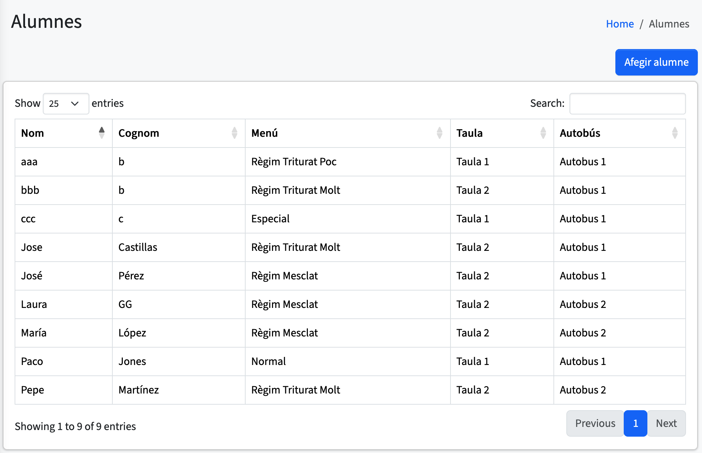
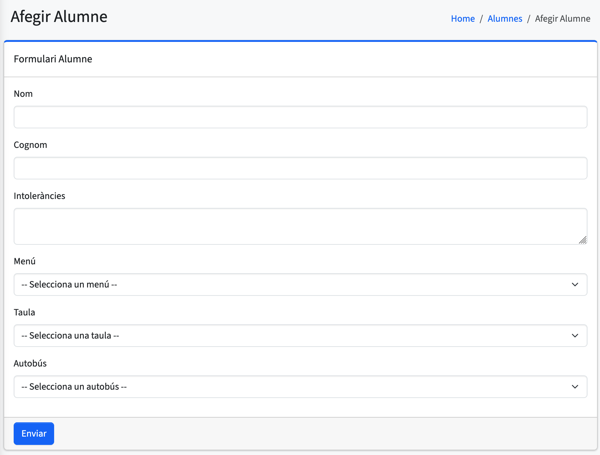
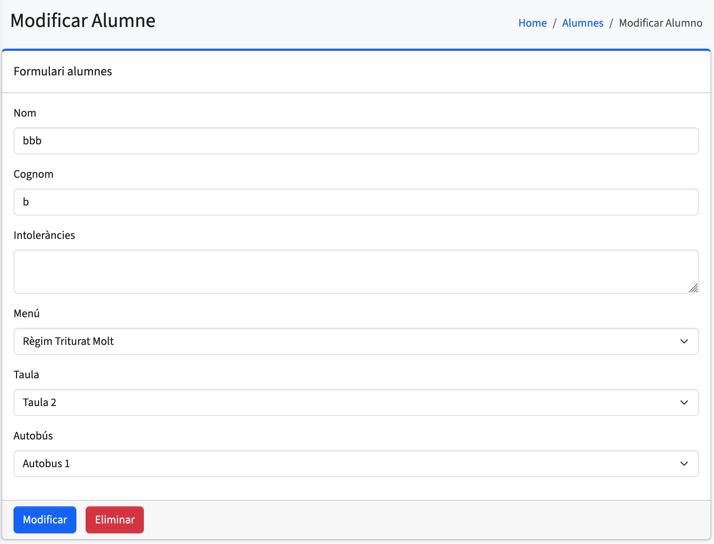

# Alumnes

En aquesta pantalla es mostra una **taula amb tots els alumnes**.  
A la taula es poden veure les columnes següents: **nom, cognoms, menú, taula i autobús**.

Aquesta vista permet consultar ràpidament la informació principal de cada alumne i la seua assignació dins del menjador.

---

## Afegir alumne

En aquesta pantalla es mostra un **formulari per afegir un alumne nou**.  
És obligatori introduir **el nom i els cognoms**.

També es poden indicar:

- Les **intoleràncies alimentàries** (si n’hi ha).
- El **menú** assignat.
- La **taula** que li correspon.
- L’**autobús** al qual està assignat.

Aquesta funcionalitat permet incorporar nous alumnes de manera senzilla i mantenir la base de dades actualitzada.

---

## Modificar alumne

Aquesta vista és **idèntica a la d’afegir alumne**, però permet **editar o modificar** les dades d’un alumne ja existent.  
S’hi accedeix **fent clic sobre una fila** de la taula d’alumnes.

Es poden actualitzar **tots els camps** del registre: nom, cognoms, intoleràncies, menú, taula i autobús.

Aquesta opció és útil per corregir o actualitzar informació dels alumnes sense necessitat d’eliminar-los ni tornar-los a afegir.