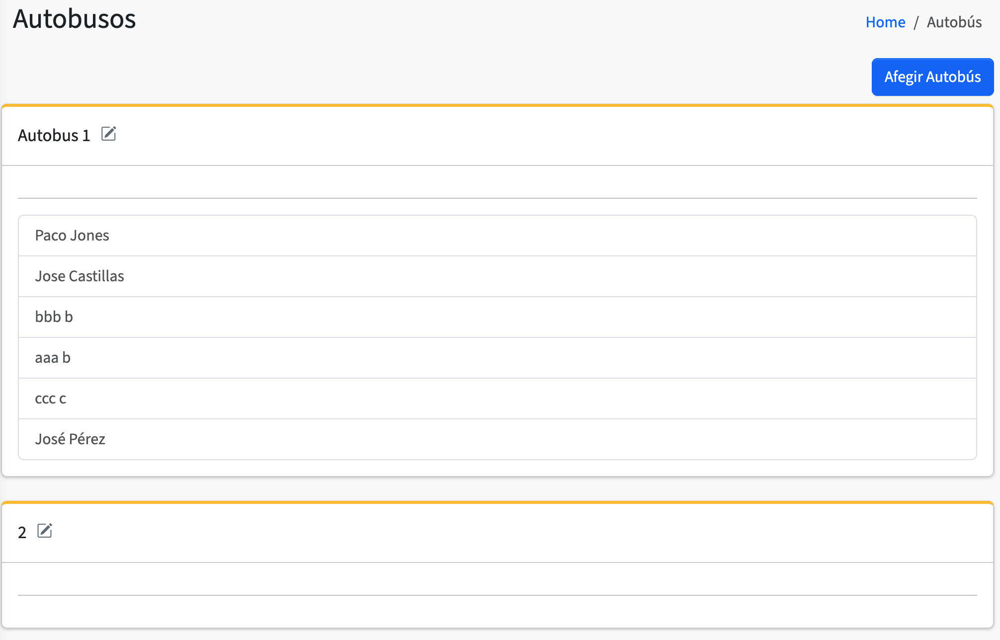
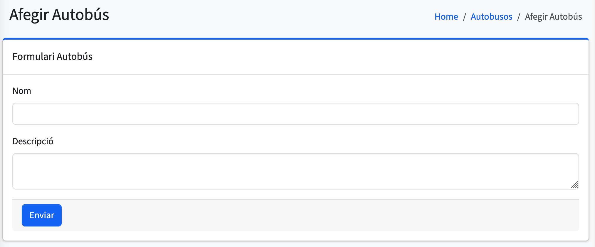
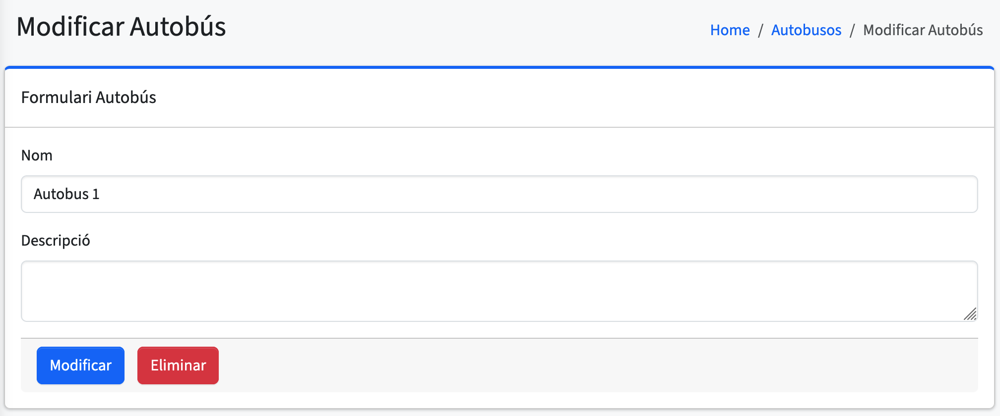

# Autobusos

En aquesta pantalla es mostra una **llista de "cards" amb tots els autobusos disponibles**.  
A cada card podem vore el **nom de l’autobús**, la **descripció**, i els **alumnes assignats a eixe autobús**.

## Afegir autobús

En aquesta pantalla es mostra un formulari per **afegir un nou autobús**.  
Cal introduir **obligatòriament el nom de l’autobús**, i opcionalment es pot afegir una **descripció** o altres detalls rellevants.

## Modificar autobús

Aquesta vista és **idèntica a la d’afegir autobús**, però s’utilitza per **editar un autobús existent**.  
S’hi accedeix **fent clic sobre un card d’autobús**.  
Podem modificar qualsevol camp, com el nom o la descripció.

