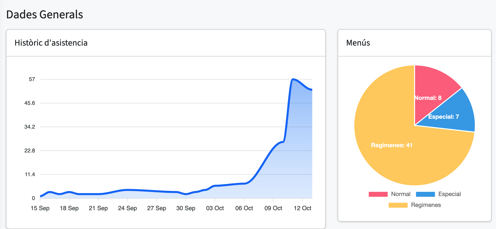
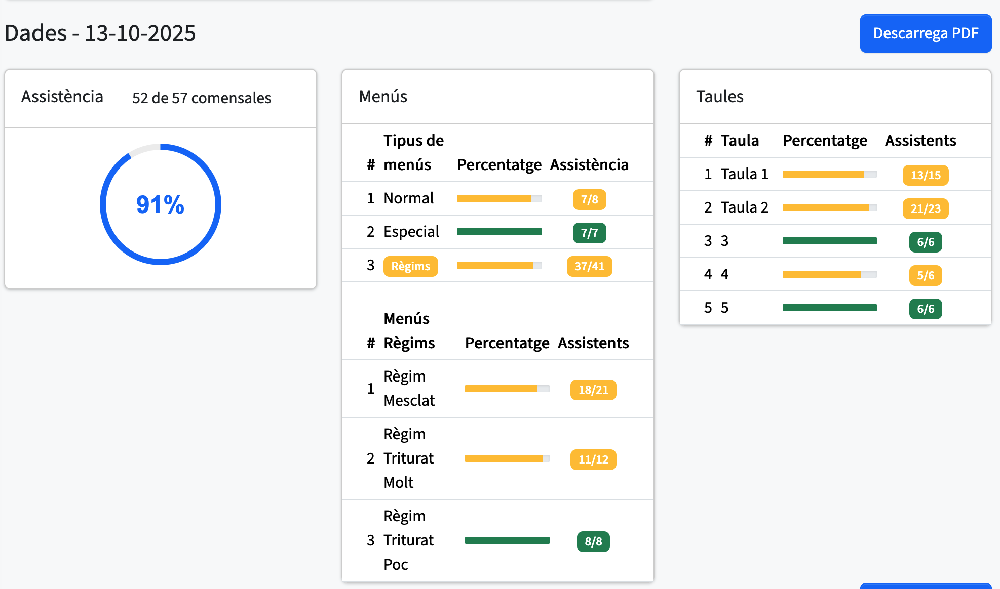
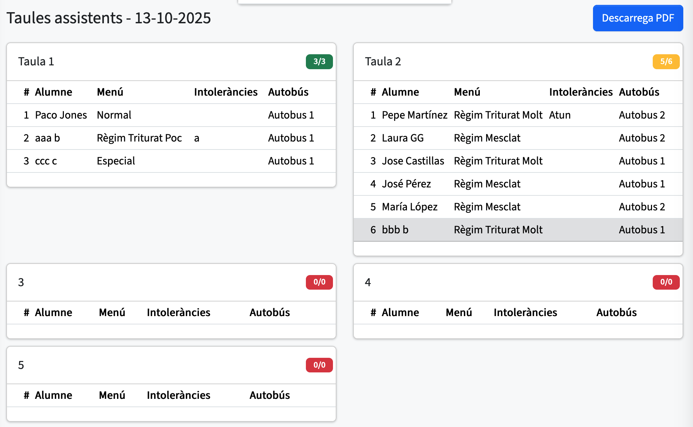
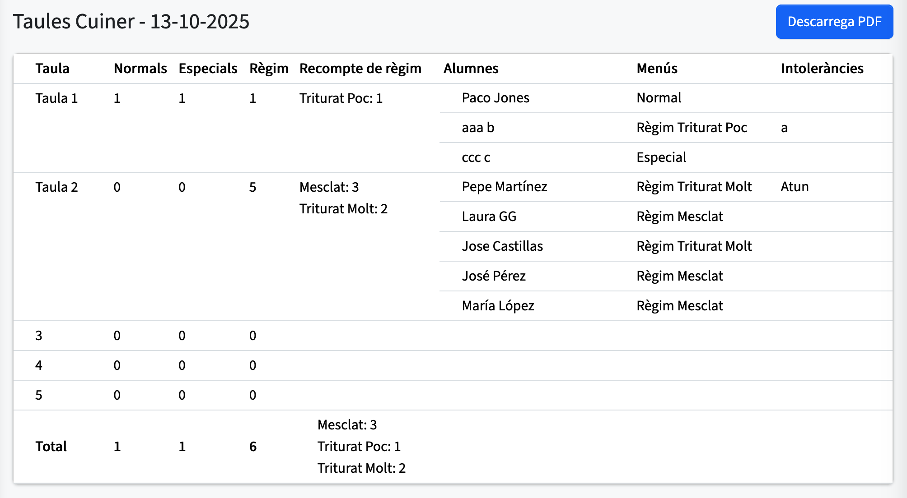

# Dashboard

En esta vista trobem diversos apartats que ens permeten visualitzar informació general i específica del menjador.

---

## Dades generals

En aquest apartat hi ha dues "cards" que mostren informació general diferent.

- **Històric d’assistència:** Una gràfica que representa el nombre d’assistents per dia durant l’últim mes.
- **Menús:** Una gràfica de tipus “tarta” que mostra el nombre de menús de cada tipus disponibles i assignats.

Aquestes visualitzacions permeten entendre ràpidament l’assistència global i la distribució dels menús en el temps.

---

## Dades d’avui

Aquest apartat mostra informació general sobre el dia actual:

- **Assistència:** Recompte d’assistents avui i percentatge d’alumnes que han assistit i es quedaran al menjador.
- **Menús:** Recompte de tots els menús assignats avui i indicació si hi ha algun assistent que ha faltat.
- **Taules:** Recompte de les taules i del nombre d’assistents per taula.

**Codi de colors:**

- **Verd:** Tots els assistents han acudit.
- **Groc:** Hi ha assistents, però la taula no està completa.
- **Vermell:** No hi ha assistents.

Aquesta codificació permet identificar ràpidament l’estat de l’assistència de cada taula i dels menús assignats.

---

## Taules d’Assistents

Proporciona una visió detallada de cada taula:

- Recompte dels assistents de cada taula, expressat en format `3/5`.
- Informació sobre el **menú** assignat a cada assistent.
- Indica si l’assistent té **intoleràncies** alimentàries.
- Mostra a quin **autobús** correspon cada assistent.

Aquesta vista ajuda a controlar de manera precisa la distribució dels assistents i els seus requeriments alimentaris.

---

## Taules del Cuiner

Vista orientada al personal de cuina amb informació específica:

- Nombre de **menús normals, especials i de règim** per taula, detallant el tipus de règim.
- Llista dels **comensals** de cada taula amb els seus **menús** i **intoleràncies**.
- A la part inferior, es mostra el **recompte total de tots els menús** assignats per al dia.

Aquesta secció permet al personal de cuina preparar els menús adequats i assegurar que es compleixen les necessitats alimentàries de cada comensal.
