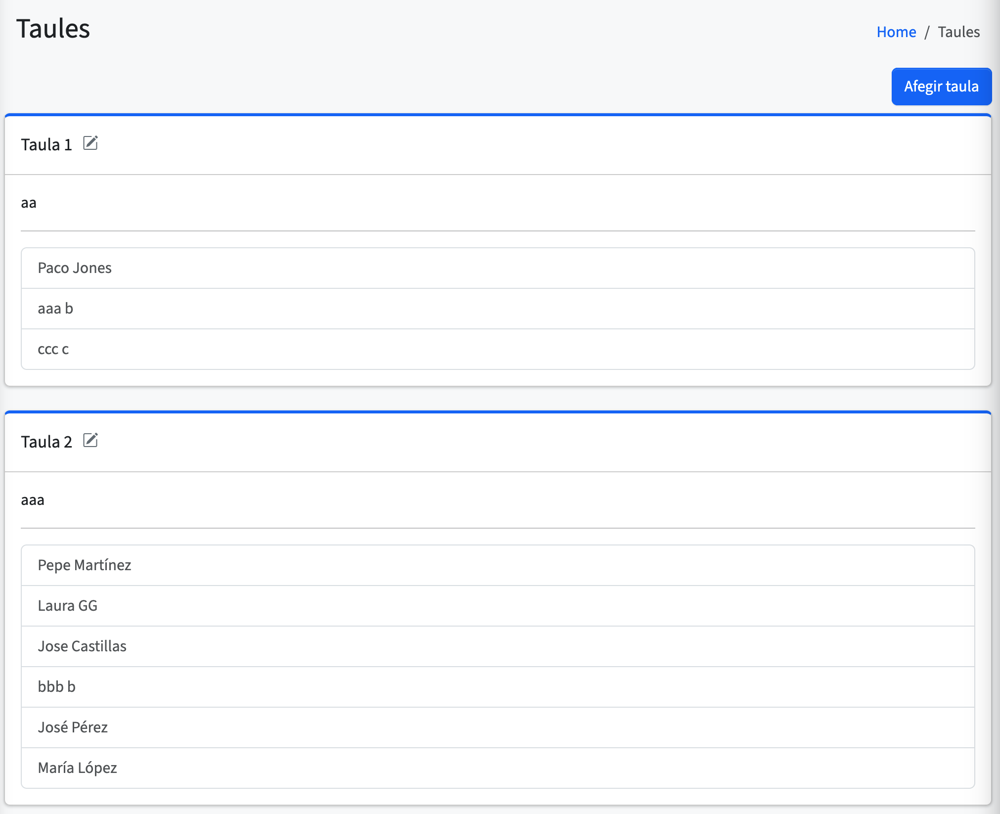
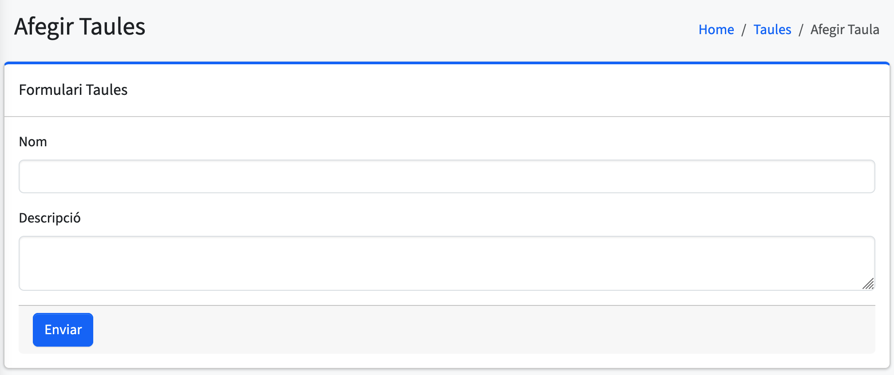
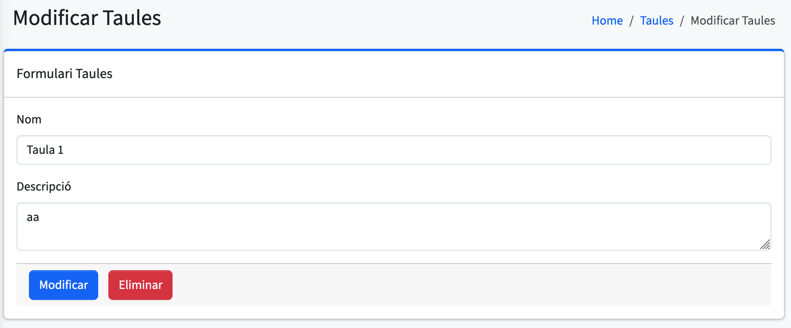

# Taules

En aquesta pantalla es mostra una **llista de "cards" amb totes les taules del menjador**.  
En cada card es pot vore el **nom de la taula**, la **descripció** i els **alumnes que pertanyen a eixa taula**.

Aquesta vista ofereix una manera visual i intuïtiva de consultar la distribució dels alumnes per taules, així com la informació associada a cadascuna.

---

## Afegir taula

En aquesta pantalla es mostra un **formulari per afegir una nova taula**.  
És obligatori introduir el **nom** de la taula.

De manera opcional, es pot afegir una **descripció** amb informació addicional, com ara la seua ubicació o ús específic.

Aquesta funcionalitat permet crear noves taules i mantindre actualitzada la configuració del menjador.

---

## Modificar taula

Aquesta vista és **idèntica a la d’afegir taula**, però permet **editar o modificar** les dades d’una taula existent.  
S’hi accedeix **fent clic sobre una fila** de la taula principal.

Es poden actualitzar **tots els camps**: el nom i la descripció.

Aquesta opció és útil per ajustar la informació de les taules del menjador sense necessitat d’eliminar-les ni crear-les de nou.